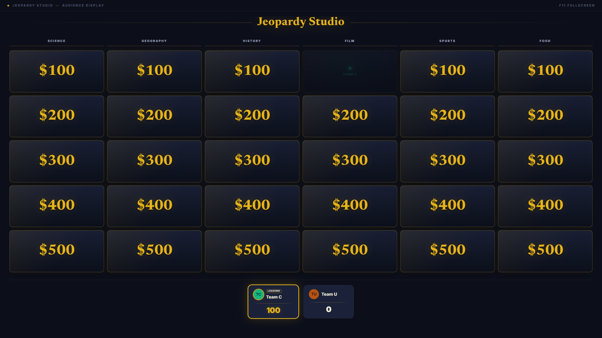
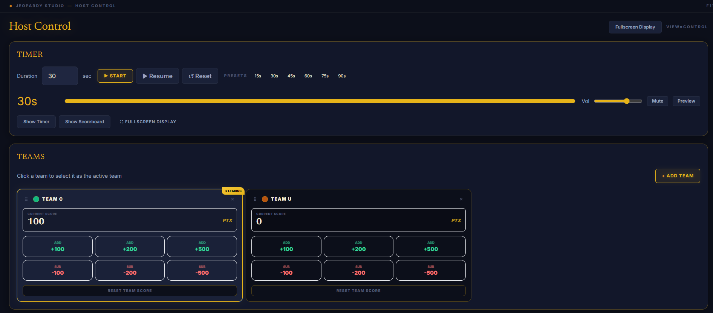
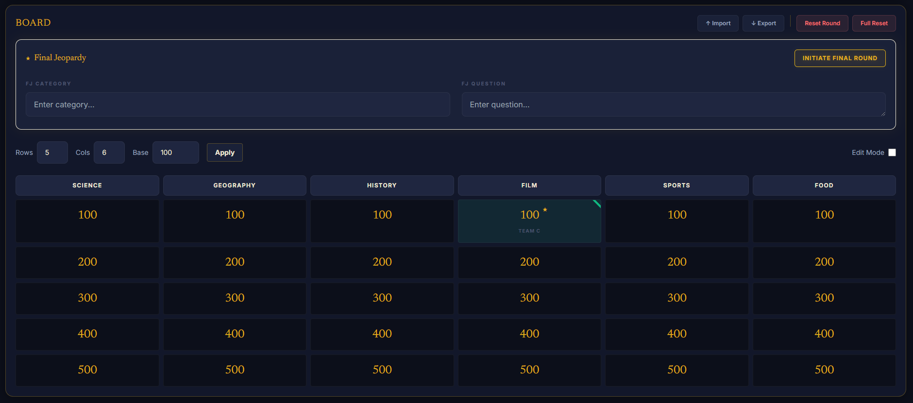
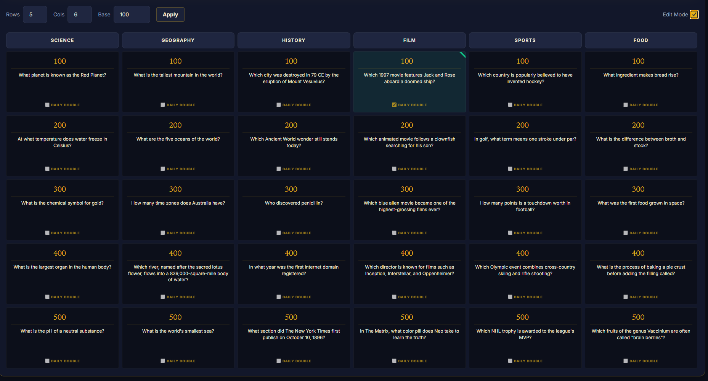
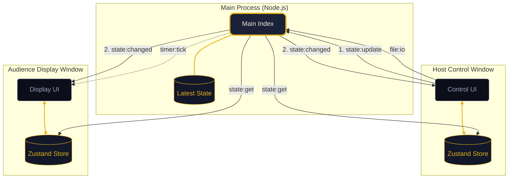

<div align="center">

# Jeopardy Studio

**A dual-window quiz show scoreboard for hosting live events.**

One window for the host. One window for the audience. Always in sync.

[](https://github.com/xMinhx/jeopardy-studio/releases)
[](https://github.com/xMinhx/jeopardy-studio/actions/workflows/ci.yml)
[](https://www.electronjs.org/)
[](https://react.dev/)
[](https://www.typescriptlang.org/)
[](LICENSE)

</div>

<br/>

<div align="center">
  
  <br/><br/>
  
</div>

---

## ⚖️ Legal Disclaimer

This project is not affiliated with, endorsed by, or sponsored by the "Jeopardy!" game show or Sony Pictures Television. This tool is for private, educational, and non-commercial use only.

---

## What is Jeopardy Studio?

Jeopardy Studio is a desktop application for hosting quiz nights. It opens two windows:
- **Host Control**: For the host to manage teams, scores, and the game board.
- **Audience Display**: For the crowd/projector to see the live game.

The windows communicate via Electron IPC, so no internet connection is required during the game.

---

## 💡 The Story

Jeopardy Studio started as a solution to a very specific problem. While serving as a House President at my university, I volunteered to host a Jeopardy-style quiz night for our students. With prizes on the line and a live audience watching, I needed a tool that looked great and wouldn't crash halfway through.

I spent hours looking for a tool that supported dual-monitor setups (one for me, one for the projector) with a clean aesthetic, but wasn't able to find anything that fit my needs. So, I decided to code my own. What started as a quick project for a university event has since been refined into Jeopardy Studio.

---

## Screenshots

<div align="center">

| Audience Display | Host Control |
| :---: | :---: |
|  |  |
| **Board Management** | **Edit Mode** |
|  |  |

</div>

---

## Features

- **Team Management**: Add/remove teams and edit scores with keyboard or mouse.
- **Game Board**: Customizable 5x5 grid (expandable) with category and point value editing.
- **Timer**: Built-in countdown with presets and audio cues.
- **Rounds**: Supports Daily Double (with wagers) and Final Jeopardy.
- **Offline First**: Runs entirely locally via Electron.
- **Import/Export**: Save and load game configurations as JSON files.

---

## Getting Started

### Technical Requirements
- **Display Resolution**: 1920x1080 (Full HD) is currently the only natively supported resolution.
- **UI Scaling**: Ensure Windows Display Settings are set to **100% Scaling** for optimal alignment.
- **Node.js**: v22+
- **OS**: Windows 10/11 (for packaging; dev mode works on Linux/macOS)

### Install and Run
```bash
git clone https://github.com/xMinhx/jeopardy-studio.git
cd jeopardy-studio
npm install
npm run dev
```

---

## Keyboard Shortcuts (Host Window)

| Key | Action |
|---|---|
| `Space` | Start/Pause timer |
| `R` | Reset timer |
| `1`-`6` | Timer presets (10s - 60s) |
| `F11` | Toggle Fullscreen |

---

## Project Structure

```text
jeopardy-studio/
├── electron/
│   ├── main/         # Window lifecycle and IPC handlers
│   └── preload/      # Secure API bridge
├── src/
│   ├── windows/      # Host (Control.tsx) and Audience (Display.tsx) windows
│   ├── features/     # Component-based features (board, teams, etc.)
│   ├── store/        # Zustand state management
│   ├── hooks/        # Shared logic (timer, audio, animations)
│   ├── services/     # External data loaders
│   ├── types/        # TypeScript definitions
│   ├── utils/        # Persistence and logic helpers
│   └── styles.css    # Global styling
├── public/
│   └── assets/       # Sound effects and icons
├── tests/            # Vitest suite
└── docs/             # Documentation and screenshots
```

---

## Architecture

Jeopardy Studio uses a master-mirror architecture built on Electron's IPC (Inter-Process Communication).



- **State Sync**: Uses a one-way IPC bridge. The Host Control owns the state; the Display window is a reactive mirror.
- **Persistence**: Game state is saved to local storage so sessions survive crashes.
- **Validation**: Zod is used to validate JSON board imports.

---

## Support the Project

If you find this project useful, consider supporting its development:

<div align="center">

[](https://github.com/sponsors/xMinhx)
<br/><br/>
<a href="https://www.buymeacoffee.com/xminhx" target="_blank">
  
</a>

</div>

---

## 🗺️ Roadmap

- [ ] **Custom Themes**: Allow users to change colors and fonts for the audience display.
- [ ] **Responsive Design**: Optimization for different screen sizes and aspect ratios.
- [ ] **Internationalization**: Support for multiple languages.
- [ ] **Advanced Animations**: Smoother transitions for category reveals and point values.

---

## 🛠️ Built With

- **Electron** — Desktop framework
- **React** — UI library
- **Zustand** — State management
- **TypeScript** — Type safety
- **Tailwind CSS** — Styling
- **Vitest** — Unit and component testing
- **Zod** — Schema validation

---

## License
MIT (c) [Minh Truong](https://github.com/xMinhx)
