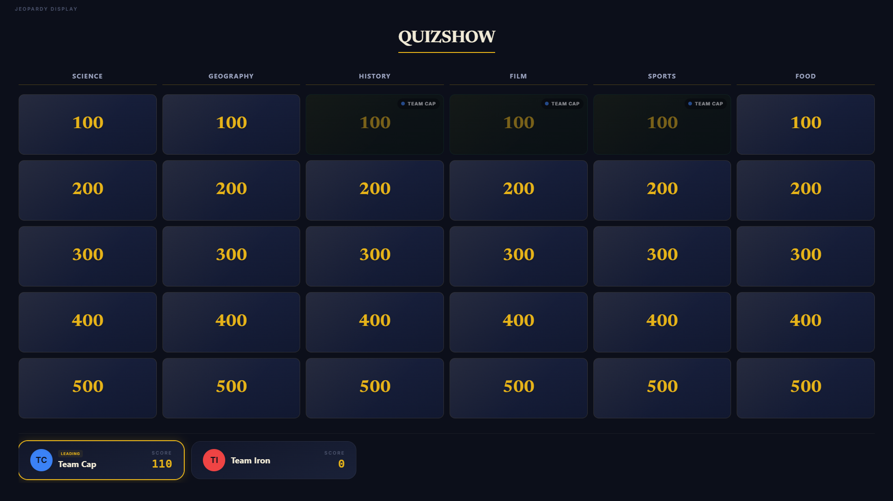
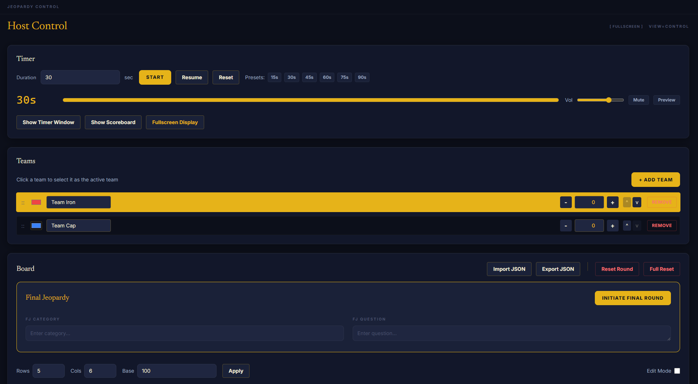
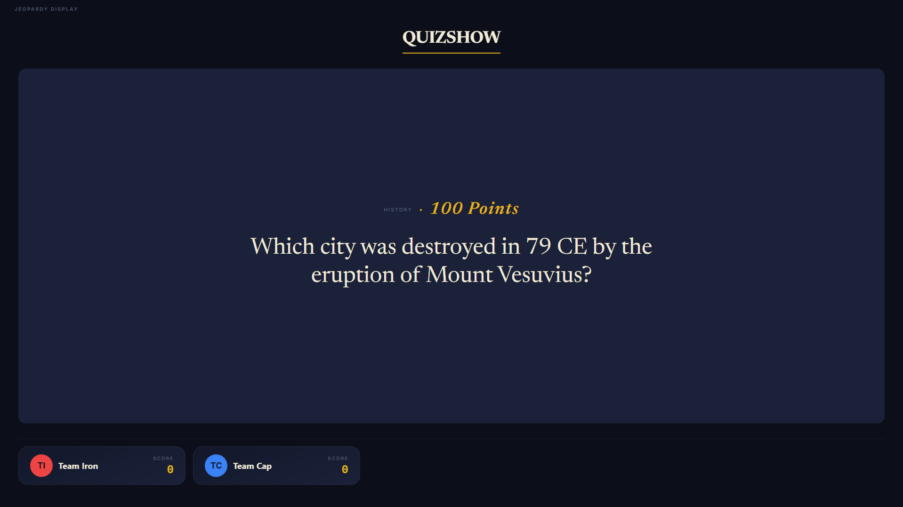

<div align="center">

# Jeopardy Studio

**A broadcast-grade, dual-window scoreboard for hosting high-end quiz show events.**

One window for you. One window for the crowd. Always in sync.

[](https://github.com/xMinhx/jeopardy-studio/actions/workflows/ci.yml)
[](https://www.electronjs.org/)
[](https://react.dev/)
[](https://www.typescriptlang.org/)
[](https://tailwindcss.com/)
[](LICENSE)

<br/>

<div align="center">
  
  <br/>
  
</div>

---

## ⚖️ Legal Disclaimer

This project is an independent creation and is **not affiliated with, endorsed by, or sponsored by** the "Jeopardy!" game show, Sony Pictures Television, or any of its subsidiaries. All "Jeopardy!" trademarks and copyrights are the property of their respective owners. This tool is intended for private, educational, and non-commercial use only.

---

## What is Jeopardy Studio?

Jeopardy Studio is a **premium desktop application** built for people who host quiz nights, classroom games, and live events. It provides a professional, TV-style experience without any subscription or complicated setup.

Launch the app and two windows open instantly:

| Window | Who sees it | What it does |
|---|---|---|
| **Host Control** | You (host) | Manage teams, scores, timer, board, and rounds |
| **Audience Display** | The crowd / projector | Shows the live board, score panel, active questions, and timer |

Both windows stay in perfect sync through a secure Electron IPC bridge: no network required.

---

## 🌟 The Executive Studio Experience

Designed for clarity and elegance, the **Executive Studio** aesthetic uses:
- **Newsreader Serif**: A sophisticated typeface for questions and categories.
- **Deep Navy & Gold**: A high-contrast, premium color palette.
- **Micro-animations**: Smooth transitions for score updates and question reveals.
- **Broadcast Layouts**: Standard TV-safe margins and readable typography.

---

## Screenshots

<table>
  <tr>
    <td align="center" width="50%">
      
      <sub><b>Audience Display: live scoreboard with team scores</b></sub>
    </td>
    <td align="center" width="50%">
      
      <sub><b>Host Control panel: timer, teams, board management</b></sub>
    </td>
  </tr>
  <tr>
    <td align="center" width="50%">
      
      <sub><b>Question reveal: category, points, and question text</b></sub>
    </td>
    <td align="center" width="50%">
      
      <sub><b>Final Jeopardy: dramatic category reveal screen</b></sub>
    </td>
  </tr>
</table>

---

## Features

### Host Control Panel
- **Team management**: add, remove, rename, color-code, and reorder teams with drag-and-drop.
- **Score editor**: award, penalize, or manually set scores with +/- buttons or direct input.
- **Countdown timer**: presets from 15 s to 90 s, keyboard shortcuts, live audio cues.
- **Board editor**: edit any cell's question, point value, or Daily Double status mid-game.
- **Import / Export**: save and restore complete game configurations as JSON files.
- **Fullscreen display**: send the audience window to fullscreen from the host panel (or press F11).

### Audience Display
- **Live game board**: 5x5 (up to 10x10) grid with claimed/open/disabled cell states.
- **Score lower-thirds**: team name badges with animated score updates and a "Leading" indicator.
- **Question overlay**: full-screen question reveal with category and point value.
- **Countdown timer view**: circular progress ring with color-alert in the final seconds.
- **Daily Double**: dedicated splash screen with team wager display.
- **Final Jeopardy**: multi-stage sequence: category reveal, wager collection, resolution.

### Game Rounds
- **Daily Double**: opens a wager workflow; wager is confirmed before the question reveals.
- **Final Jeopardy**: full round with secret wagers per team, question reveal, and scored resolution.
- **Winner screen**: top-5 podium with animated score reveal and victory sound effect.

---

## Getting Started

### Prerequisites

- [Node.js](https://nodejs.org/) v22 or later
- npm (bundled with Node.js)
- Windows 10 / 11 (for the packaged installer; dev mode works on any OS with Electron)

### Install and Run

```bash
git clone https://github.com/xMinhx/jeopardy-studio.git
cd jeopardy-studio
npm install
npm run dev
```

Two windows open: the **Host Control** window and the **Audience Display** window.

### Build a Distributable Installer

```bash
npm run build
```

The NSIS installer for Windows is written to the `release/` directory.

---

## Keyboard Shortcuts

> Shortcuts work while the **Host Control** window is focused.

| Key | Action |
|---|---|
| `Space` | Start or resume the timer |
| `R` | Reset the timer |
| `1` through `6` | Jump to a timer preset (10 s, 15 s, 20 s, 30 s, 45 s, 60 s) |
| `F11` | Toggle fullscreen on the Host Control window |

> Press **F11** in the Audience Display window to toggle fullscreen on the projector.

---

## Project Structure

```
jeopardy-studio/
├── electron/
│   ├── main/         # Main process: window lifecycle, IPC handlers, file I/O
│   └── preload/      # Secure context bridge exposed as window.api
├── src/
│   ├── windows/      # Control.tsx (host) and Display.tsx (audience)
│   ├── features/
│   │   ├── board/    # Board grid, cell utilities, BoardCard component
│   │   ├── teams/    # TeamRow, TeamCard, team factory
│   │   └── common/   # AnimatedNumber and shared components
│   ├── store/        # Zustand store: all game state in one place
│   ├── hooks/        # useTimer, useTimerAudio, useGameAudio, useAnimatedNumber
│   ├── services/     # Default board preset loader
│   ├── types/        # TypeScript interfaces, Zod validation schemas, window.api types
│   └── utils/        # State persistence helpers
├── public/
│   ├── assets/       # Sound effects (timer, score up/down, Daily Double, Final Jeopardy)
│   └── board-default.json   # Default game board loaded on first run
├── tests/            # Vitest unit tests (89+ tests covering store and logic)
│   ├── boardStore.test.ts
│   ├── boardUtils.test.ts
│   └── teamFactory.test.ts
└── docs/adr/         # Architecture Decision Records
```

---

## Architecture

Jeopardy Studio is built on a few deliberate choices:

**Dual-window IPC sync**: The host Control window owns all game state via Zustand. On every state change, it broadcasts a snapshot to the Display window via Electron IPC. The Display is read-only and stateless; it never writes back. This eliminates sync conflicts entirely.

**Zustand with persistence**: Game state (board, teams, scores, round progress) is persisted to `localStorage` via `zustand/middleware/persist`. Sessions survive accidental closes.

**Zod for import validation**: JSON board imports are validated against a Zod schema before they touch the store, preventing corrupt data from breaking an in-progress game.

**Context-isolated preload**: The `window.api` bridge is exposed only through `contextBridge`, keeping Node.js APIs completely out of the renderer process.

See [`docs/adr/`](docs/adr/) for detailed Architecture Decision Records.

---

## Contributing

Contributions are welcome! Please read [CONTRIBUTING.md](CONTRIBUTING.md) before submitting a pull request.

```bash
# Run the full quality check before opening a PR
npm run typecheck && npm run lint && npm test
```

This project follows [Conventional Commits](https://www.conventionalcommits.org/). Use prefixes like `feat:`, `fix:`, `chore:`, `docs:`.

---

## Roadmap

- [ ] **Responsiveness**: Improved support for various projector resolutions and small-screen displays.

---

## License

MIT (c) [Minh Truong](https://github.com/xMinhx)
